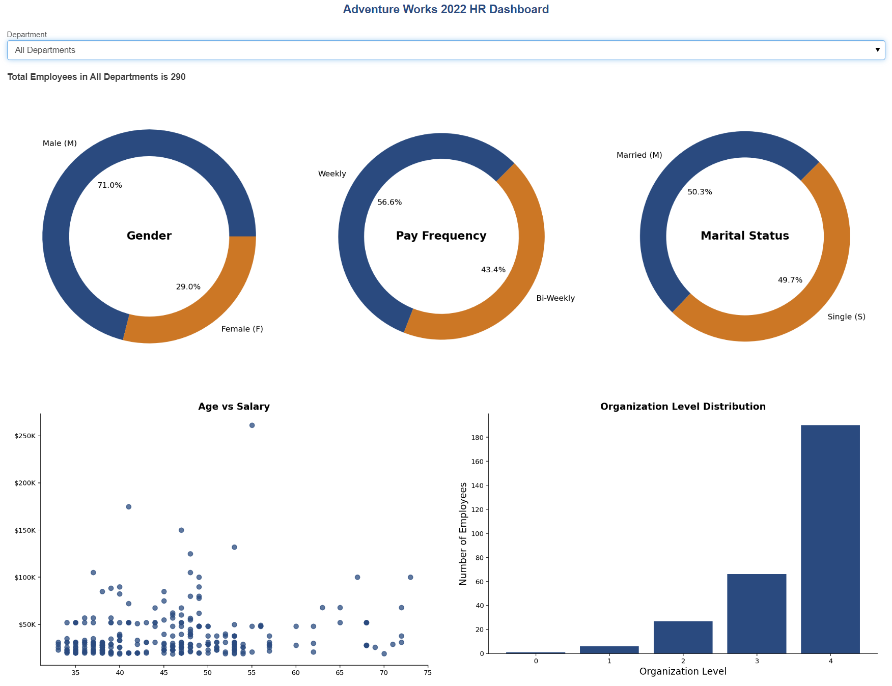
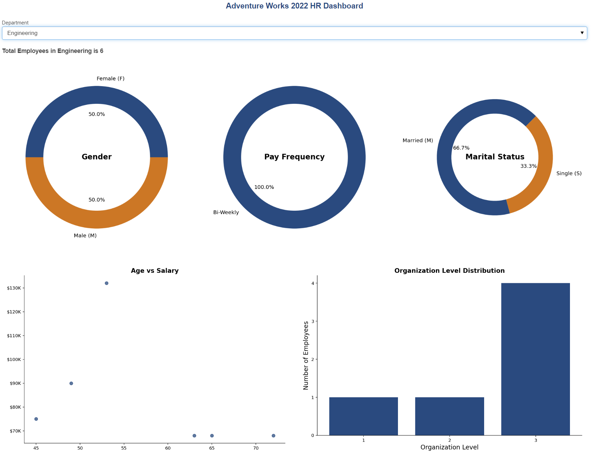
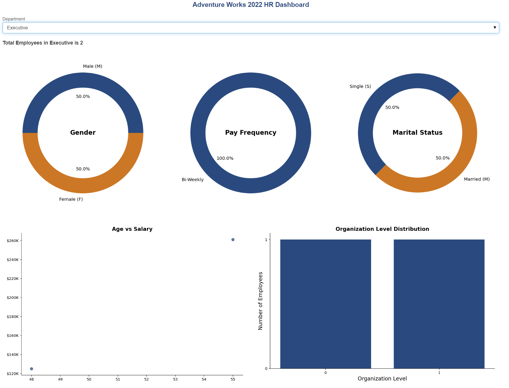
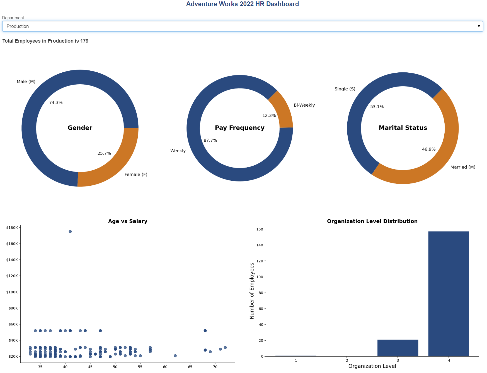
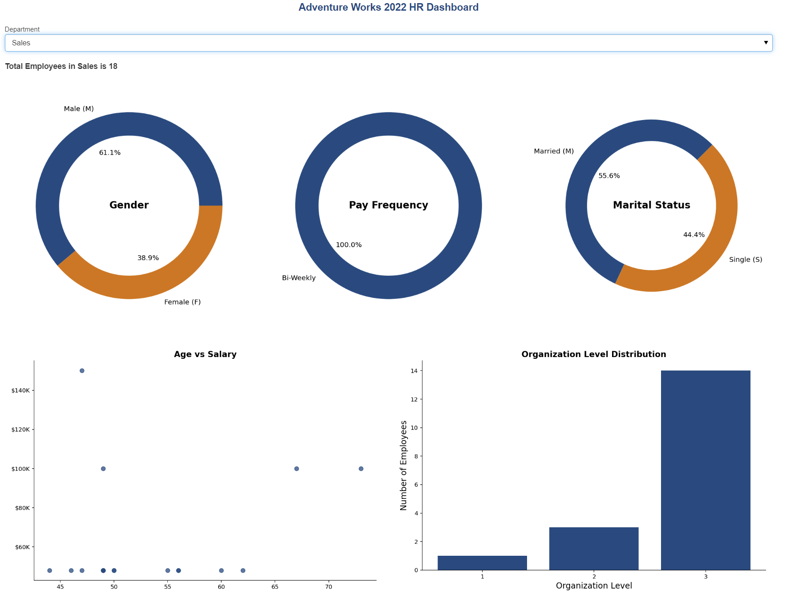

# Overview 
## Introduction
In this project, I set out to analyze a custom Human Resources dataset derived from the Adventure Works 2022 dataset in Microsoft SQL Server. This involved creating a comprehensive SQL view that integrated data from 11 different tables, resulting in a robust dataset comprising 31 columns related to employee information. By importing this dataset into Python, I was able to clean and preprocess the data effectively, eliminating duplicate employee entries and ensuring accuracy in capturing the most recent department and pay information.

Utilizing this refined dataset, I conducted in-depth analyses to explore various employee attributes, including gender, marital status, department, pay frequency, shift, organizational level, salary, and age. The culmination of my efforts was the development of a dynamic dashboard featuring five visually informative charts that present key insights by department within the Adventure Works employee dataset. This dashboard not only highlights critical HR metrics but also serves as a powerful tool for understanding employee demographics and organizational dynamics.

## The Questions

Below are the questions I looked to answer in this project:

1. What are the primary demographic and demographic trends within the Adventure Works workforce?

2. How do the departments at Adventure Works differ in terms of employee composition and characteristics?

3. Are there any opportunities to optimize Adventure Works' hiring practices based on the data?

4. What potential enhancements could maximize the dashboard's value for decision-making?

## Tools Used for the Analysis

I used the following tools for this analysis:

* **Python**: The main tool for the analysis, used to analyze the data, and find the answer to the questions. The following libraries were used in Python:
    * **Pandas Library**: Used to analyze the data.
    * **Matplotlib Library**: To visualize the data.
    * **Seaborn Library**: Create more advanced visualizations.
    * **Datetime**: Used to format dates.
    * **Funcformatter**: To format text for plots.
    * **Pyodbc**: Used to load data from SQL server.
    * **Panel**: To create dashboards in Python.
* **SQL**: A program used to manage, manipulate, and query data.
* **Microsoft SQL Server**: A relational database management system.
* **Jupyter Notebooks**: A tool for running Python scripts and easily including notes and analysis.
* **Visual Studio Code**: A program for executing Python scripts.
* **Git & GitHub**: For version control and sharing Python code and analysis.

## Data Collection and View Creation
I reviewed the Adventure Works 2022 dataset in Microsoft SQL Server to identify the necessary tables and columns for this analysis. From this, I created a new view specifically designed to provide HR employee information.

```SQL
Create View HumanResources.vEmployeeHRProject AS
(
	SELECT 
	edh.BusinessEntityID,
	edh.DepartmentID,
	edh.ShiftID,
	edh.StartDate, 
	edh.EndDate,
	e.JobTitle,
	e.BirthDate,
	e.MaritalStatus,
	e.Gender,
	e.HireDate,
	e.SalariedFlag,
	e.VacationHours,
	e.SickLeaveHours,
	e.OrganizationLevel,
	p.PersonType,
	p.FirstName,
	p.LastName,
	d.Name DepartmentName, 
	d.GroupName DepartmentGroup,
	eph.RateChangeDate,
	eph.Rate,
	eph.PayFrequency,
	s.Name ShiftName,
	s.StartTime ShiftStart,
	s.EndTime ShiftEnd,
	bea.AddressID,
	a.City,
	a.PostalCode,
	pp.PhoneNumber,
	pp.PhoneNumberTypeID,
	pnt.Name PhoneType

	FROM HumanResources.EmployeeDepartmentHistory edh
	LEFT JOIN HumanResources.Employee e
	ON e.BusinessEntityID = edh.BusinessEntityID
	LEFT JOIN Person.Person p
	ON p.BusinessEntityID = edh.BusinessEntityID
	LEFT JOIN HumanResources.Department d
	ON d.DepartmentID = edh.DepartmentID
	LEFT JOIN HumanResources.EmployeePayHistory eph
	ON eph.BusinessEntityID = edh.BusinessEntityID
	LEFT JOIN HumanResources.Shift s
	ON s.ShiftID = edh.ShiftID
	LEFT JOIN Person.BusinessEntityAddress bea
	ON bea.BusinessEntityID = edh.BusinessEntityID
	LEFT JOIN Person.Address a
	ON a.AddressID = bea.AddressID
	LEFT JOIN Person.PersonPhone pp
	ON pp.BusinessEntityID = edh.BusinessEntityID
	LEFT JOIN Person.PhoneNumberType pnt
	ON pnt.PhoneNumberTypeID = pp.PhoneNumberTypeID
)

```

## Load Libraries and Dataset via SQL
I loaded all essential libraries required to construct the dashboard, including tools for data visualization, loading the data and text generation. The dataset, initially created in Microsoft SQL Server, was then imported into Python to facilitate the analysis and final dashboard creation.

``` python
import pyodbc
import pandas as pd
import matplotlib.pyplot as plt
import matplotlib.ticker as mticker
import seaborn as sns
from datetime import datetime 
from matplotlib.ticker import FuncFormatter

# Define the connection string
conn = pyodbc.connect(
    'DRIVER={ODBC Driver 17 for SQL Server};'
    'SERVER=localhost\\SQLEXPRESS;'
    'DATABASE=AdventureWorks2022;'
    'Trusted_Connection=yes;'
)


# Write the SQL query to select data from the view
sql_query = "SELECT * FROM HumanResources.vEmployeeHRProject ORDER BY BusinessEntityID"

# Load the data from SQL Server into a pandas DataFrame
df = pd.read_sql(sql_query, conn)

# Display the first few rows of the DataFrame
df.head()

# Close the connection
conn.close()

```

## Data Cleaning
The data was refined by removing duplicate employee entries associated with outdated departments and pay rates. Only the most recent information was retained for each employee, ensuring accuracy and relevance in the dataset.

``` python
# Step 1: Filter for rows where 'EndDate' is null
filtered_df = df[df['EndDate'].isnull()]

# Step 2: Sort by 'RateChangeDate' within each 'BusinessEntityID'
# and keep only the latest one
cleaned_df = (filtered_df
              .sort_values('RateChangeDate', ascending=False)
              .groupby('BusinessEntityID')
              .first()  # Keep the first entry after sorting (latest RateChangeDate)
              .reset_index())

# Fill NaN values in 'OrganizationLevel' with 0
cleaned_df['OrganizationLevel'] = cleaned_df['OrganizationLevel'].fillna(0)

```
## Adding Age and Salary Columns to the Dataset
New columns for Age and Salary (calculated based on 2,080 hours at the current pay rate) were created to support a Salary vs. Age scatterplot for the dashboard. These additions provide essential data points for the analysis.

``` python
# Convert 'BirthDate' to datetime
cleaned_df['BirthDate'] = pd.to_datetime(cleaned_df['BirthDate'])

# Ensure 'Rate' is a string before removing the dollar sign and converting to numeric
cleaned_df['Rate'] = cleaned_df['Rate'].astype(str).str.replace('$', '').str.strip()
cleaned_df['Rate'] = pd.to_numeric(cleaned_df['Rate'], errors='coerce')

# Calculate Age
current_date = datetime.now()
cleaned_df['Age'] = (current_date - cleaned_df['BirthDate']).dt.days // 365

# Calculate Salary based on hourly rate (assuming 2080 working hours in a year)
cleaned_df['Salary'] = cleaned_df['Rate'] * 2080  # Annual salary

```

## Create Final Dashboard

After finalizing a layout that includes a dropdown menu to select individual departments or view all, I arranged three donut charts across the top row to display gender, marital status, and pay frequency distributions. The bottom section features two visualizations: a scatter plot of Age vs. Salary and a bar chart illustrating the number of employees by organizational level. The dashboard was developed using Panel within a Python Jupyter Notebook.

``` python

import panel as pn
import matplotlib.pyplot as plt

# Ensure Panel extension is loaded
pn.extension(sizing_mode="stretch_width")

# Custom CSS for the dropdown
css = """
<style>
    .custom-dropdown {
        background-color: white;
        border: 1px solid #1cbe92;  /* Optional: Border color */
        color: #1cbe92;              /* Optional: Text color */
    }
</style>
"""
pn.config.raw_css.append(css)

# Function to update the dashboard based on department selection
def update_dashboard(department):
    if department == 'All Departments':
        df_filtered = cleaned_df
    else:
        df_filtered = cleaned_df[cleaned_df['DepartmentName'] == department]
    
    # Total Employees
    total_employees = f' in {department} is {len(df_filtered)}'

    # Marital Status Donut Plot
    marital_status_counts = df_filtered['MaritalStatus'].value_counts()
    marital_status_labels = ["Married (M)" if label == "M" else "Single (S)" for label in marital_status_counts.index]
    marital_status_fig, ax = plt.subplots(figsize=(5, 5))
    ax.pie(marital_status_counts, labels=marital_status_labels, autopct='%1.1f%%', startangle=45, wedgeprops=dict(width=0.25), colors=['#254b7f', '#CE7623'])
    ax.text(0, 0, 'Marital Status', fontsize=14, ha='center', va='center', fontweight='bold')
    plt.tight_layout()
    plt.close(marital_status_fig)
    
    # Gender Donut Plot
    gender_counts = df_filtered['Gender'].value_counts()
    gender_labels = ["Male (M)" if label == "M" else "Female (F)" for label in gender_counts.index]
    gender_fig, ax = plt.subplots(figsize=(5, 5))
    ax.pie(gender_counts, labels=gender_labels, autopct='%1.1f%%', startangle=0, wedgeprops=dict(width=0.25),colors=['#254b7f', '#CE7623'])
    ax.text(0, 0, 'Gender', fontsize=14, ha='center', va='center', fontweight='bold')
    plt.tight_layout()
    plt.close(gender_fig)

    # Pay Frequency Donut Plot
    pay_frequency_counts = df_filtered['PayFrequency'].map({1: "Weekly", 2: "Bi-Weekly"}).value_counts()
    pay_frequency_fig, ax = plt.subplots(figsize=(5, 5))
    ax.pie(pay_frequency_counts, labels=pay_frequency_counts.index, autopct='%1.1f%%', startangle=45, wedgeprops=dict(width=0.25),colors=['#254b7f', '#CE7623'])
    ax.text(0, 0, 'Pay Frequency', fontsize=14, ha='center', va='center', fontweight='bold')
    plt.tight_layout()
    plt.close(pay_frequency_fig)

    # Age vs Salary Scatter Plot
    scatter_fig, ax = plt.subplots(figsize=(9, 6))
    ax.scatter(df_filtered['Age'], df_filtered['Salary'], s=50, alpha=0.75, color='#254b7f')
    ax.set_xlabel('')
    ax.set_ylabel('')
    ax.set_title('Age vs Salary', fontsize=14, fontweight='bold')
    # Custom formatter to display y-axis labels as $10K, $20K, etc.
    ax.yaxis.set_major_formatter(FuncFormatter(lambda x, _: f'${int(x / 1000)}K'))
    sns.despine()
    plt.tight_layout()
    plt.close(scatter_fig)
    
   # Organization Level Plot
    org_level_counts = df_filtered['OrganizationLevel'].value_counts().sort_index()
    org_level_fig, ax = plt.subplots(figsize=(9, 6))
    ax.bar(org_level_counts.index, org_level_counts.values, color='#254b7f')
    ax.set_xlabel('Organization Level', fontsize=14)
    ax.set_ylabel('Number of Employees', fontsize=14)
    ax.set_title('Organization Level Distribution', fontsize=14, fontweight='bold')

    # Set x and y axes to show only whole numbers
    ax.xaxis.set_major_locator(mticker.MaxNLocator(integer=True))
    ax.yaxis.set_major_locator(mticker.MaxNLocator(integer=True))
    sns.despine()
    plt.tight_layout()
    plt.close(org_level_fig)
    
    # Create the dashboard layout using GridSpec for alignment
    grid = pn.GridSpec(sizing_mode='stretch_both', max_height=1200, max_width=1400)
    grid.margin = (0, 0, 0, 0)
    grid.spacing = 0

    # Add widgets and plots to the grid
    grid[0, 8:12] = pn.pane.Matplotlib(marital_status_fig)
    grid[0, :4] = pn.pane.Matplotlib(gender_fig)
    grid[0, 4:8] = pn.pane.Matplotlib(pay_frequency_fig)
    grid[1, :6] = pn.pane.Matplotlib(scatter_fig)
    grid[1, 6:12] = pn.pane.Matplotlib(org_level_fig)
    
    # Add Total Employees as text at the top of the grid
    total_text = pn.pane.Markdown(f"### Total Employees {total_employees}")
    
    return pn.Column(total_text, grid)

# Department selector widget
department_selector = pn.widgets.Select(name='Department', options=['All Departments'] + cleaned_df['DepartmentName'].unique().tolist(), value='All Departments')

# Bind the update function to the department selector
dashboard = pn.bind(update_dashboard, department_selector)

# Add a title for the dashboard with custom color and background styling
title = pn.pane.Markdown(
    "<h2 style='text-align: center; color: #254b7f; background-color: white;'>Adventure Works 2022 HR Dashboard</h2>"
)

# Display the dashboard with a fixed size of 1400x800
pn.Column(title, department_selector, dashboard, width=1400, height=1100).servable()

```

## Dashboard Views
The screenshots below illustrate the dashboard and the updated charts following a change in department selection.

*Dashboard showing results of All Departments*

*Dashboard showing the Engineering Department selected*

*Dashboard showing the Executive Department selected*

*Dashboard showing the Production Department selected*

*Dashboard showing the Sales Department selected*

## What are the primary demographic and demographic trends within the Adventure Works workforce?

## Insights

* The majority of employees are male (71.0%).
* Most employees are paid Weekly (56.6%).
* A small majority of employees are married (50.3%).
* There is a wide range of salaries across age groups, with a general trend of increasing salary with age.
* General diversity is evident in some departments but not others, with Production showing less diversity comparedto Engineering.
* Differences in pay frequency and marital status across departments could reflect the nature of employment contacts or demographic patterns.

## How do the departments at Adventure Works differ in terms of employee composition and characteristics?

* Engineering: Gender ratio is balanced, with all employees paid bi-weekly. The majority are married, with salaries increasing alongside age, indicating seniority-based pay. Most employees are in mid-level positions, suggesting a skilled and experienced workforce.

* Marketing: Slightly male-dominated, all employees are paid bi-weekly, and the workforce is younger, with a majority of single employees. Salaries are on the lower end, and most employees hold mid-level roles, implying a younger or less senior workforce.

* Production: Predominantly male, with a weekly pay structure for most employees. Marital status is balanced, and salaries are concentrated at the lower end, with the majority of employees in entry-level positions. This is the largest department, comprising over 61% of the total workforce, focusing primarily on operational roles.

* Executive: Gender ratio is balanced, with all employees on a bi-weekly pay schedule. Marital status is balanced, with the highest salary levels and highest organizational roles. This is the smallest department, consisting of only two employees.

* Sales: Predominantly male and paid bi-weekly, with a varied salary distribution. Most employees hold entry-level or junior roles.

* Human Resources: Predominantly male, with all employees paid bi-weekly. The majority of employees are single, and there is no clear correlation between age and salary. Most employees are at organizational level 3, indicating a concentration of mid-level roles.

* Marketing: Slightly male-dominated, all employees are paid bi-weekly, with a slight majority being single. There is no clear correlation between age and salary, and most employees are at level 2, indicating mid-level roles.

* Production Control: Entirely male, all employees are paid bi-weekly, with a significant majority (83.3%) being married. There is no clear correlation between age and salary. Most employees are at level 3, indicating a concentration in mid-level roles.

* Research & Development: Gender is evenly split, and all employees are paid bi-weekly. Most employees are married, with no clear correlation between age and salary, and data points spread across the range. The majority of roles are at level 4, suggesting entry-level positions, with a few employees at level 3.

* Shipping and Receiving: Predominantly male, with a mix of weekly and bi-weekly pay. Marital status is balanced, and there is no clear correlation between age and salary. Most employees are at level 4, indicating entry-level roles.

* Tool Design: Predominantly male, with all employees paid bi-weekly and marital status evenly split between single and married. There is no clear correlation between age and salary. Employees are split between levels 3 and 4, representing mid-level and entry-level roles, respectively.

## Are there any opportunities to optimize Adventure Works' hiring practices based on the data?

1. Enhance Gender Diversity in Male-Dominated Departments: Departments like Production, Sales, Production Control, and Tool Design are predominantly male. Implementing targeted recruitment strategies, such as outreach to diverse talent pools, partnerships with organizations that promote gender diversity, or creating internships specifically aimed at underrepresented groups, could improve gender diversity in these departments. Gender diversity could bring fresh perspectives and foster a more inclusive work environment.

2. Increase Flexibility in Pay Frequency: A significant portion of employees, particularly in Production, receive weekly pay, while most others are paid bi-weekly. To create uniformity and support employees who prefer flexibility, Adventure Works might consider offering employees a choice between weekly and bi-weekly pay or switching to a semi-monthly pay schedule for all departments. Standardizing pay frequency can reduce administrative costs while accommodating employee preferences.

3. Focus on Seniority and Development Pathways in Production: Production has a large, predominantly entry-level workforce with low salary levels and fewer senior roles, indicating limited upward mobility. Adventure Works could introduce training and development programs that allow Production employees to advance within the company. Clear career pathways may reduce turnover and increase employee satisfaction.

4. Encourage Diversity in Marital Status and Age: Some departments, such as Production Control, have a high proportion of married employees, while Marketing and Human Resources skew toward single employees. This might reflect hiring trends that favor certain demographics over others. Expanding recruitment to reach a broader age and demographic range could diversify perspectives, which may benefit team dynamics and creativity.

5. Focus on Diversity in Senior Roles: With only two employees in the Executive department, Adventure Works has a very small leadership team. As the company grows, it could benefit from recruiting diverse leaders to represent a broader range of backgrounds, skills, and ideas. This would help foster inclusive leadership, enhancing decision-making and innovation at the top levels.

6. Address Underrepresentation in High-Level Roles Across Departments: Departments like Research & Development and Shipping and Receiving consist largely of entry-level roles, potentially limiting career advancement opportunities for those employees. Establishing a mentorship program or career development initiatives within these departments could support employees’ career progression and address the concentration of entry-level positions.

7. Review Compensation and Advancement Patterns Based on Age and Experience: While some departments show a correlation between age and salary, others do not. Conducting a review of salary and advancement practices could help ensure fair and consistent compensation across departments. Adventure Works might consider implementing performance-based incentives to encourage employee retention and motivate employees across age groups and experience levels.

8. Enhance Hiring in Understaffed or Smaller Departments: Some departments, such as the Executive team and possibly Human Resources, are notably small. Strategic hiring in these areas can help balance workloads and bring new ideas and capacity, particularly in HR where a larger team can support ongoing diversity and inclusion efforts.

9. Promote Diversity and Inclusion in Recruitment Branding: Adventure Works’ hiring materials could emphasize diversity, equity, and inclusion to attract candidates from a wide range of backgrounds. Highlighting the company’s commitment to diversity in job postings, on the website, and through social media channels can make the company more attractive to diverse candidates.

## What potential enhancements could maximize the dashboard's value for decision-making?

1. Add Time Dimension:
Include a time dimension (e.g., year-over-year comparison, quarterly trends) to identify changes in demographics, pay frequency, or marital status over time.
This would help in understanding the dynamics of the workforce and potential areas for improvement.

2. Include Additional Demographic Data:
Incorporate data on race, ethnicity, education level, and other relevant demographic factors to provide a more comprehensive view of the workforce.
This would help in identifying potential biases and disparities in hiring, promotion, and compensation practices.

3. Include Performance Metrics:
Integrate performance metrics (e.g., sales figures, productivity, customer satisfaction) alongside demographic data to understand how different groups perform.
This would help in identifying areas for improvement and potential training needs.

4. Add Location Information:
If applicable, include location information (e.g., region, country) to identify regional variations in demographics and workforce trends.
This would help in tailoring HR strategies to specific regions and addressing location-specific challenges.

5. Interactive Features:
Implement interactive features like filters, drill-down capabilities, and customizable visualizations to allow users to explore the data in more depth.
This would empower users to ask their own questions and gain insights tailored to their specific needs.

6. Data Granularity:
Consider adding more granular data, such as department-level or team-level breakdowns, to provide a more detailed view of the workforce.
This would help in identifying specific areas of concern and tailoring interventions accordingly.

7. Predictive Analytics:
Implement predictive analytics to forecast future trends in workforce demographics and identify potential risks or opportunities.
This would help in proactive planning and decision-making.

8. User Feedback and Continuous Improvement:
Gather feedback from users to understand their needs and preferences.
Continuously improve the dashboard based on user feedback and evolving business needs.

By implementing these enhancements, the Adventure Works 2022 HR dashboard can become a powerful tool for decision-making, helping HR leaders identify trends, address challenges, and drive positive change within the organization.

## Conclusion

This HR dashboard analysis of Adventure Works' employee dataset reveals key insights into the company's workforce composition and organizational structure. Through a detailed examination of department characteristics, pay frequency, marital status, and other demographics, we identified areas where diversity and workforce structure vary significantly across departments. For example, Production is highly male-dominated and consists mostly of entry-level roles with weekly pay, while departments like Engineering show a more balanced gender ratio with predominantly mid-level, bi-weekly paid positions. Differences in these attributes highlight opportunities for Adventure Works to diversify their recruitment efforts and to create development pathways for employees, particularly in large operational departments.

The findings suggest several optimization strategies for Adventure Works' hiring practices, including enhancing gender diversity in male-dominated departments, standardizing pay frequency, and expanding recruitment to attract candidates across a broader age and demographic range. By addressing these areas and implementing targeted initiatives, Adventure Works can foster a more inclusive work environment, support employee advancement, and optimize workforce dynamics to align with the company's long-term goals. With further enhancements, such as the addition of time-based data and interactive dashboard features, this tool can continue to serve as an invaluable resource for informed decision-making in HR management.
